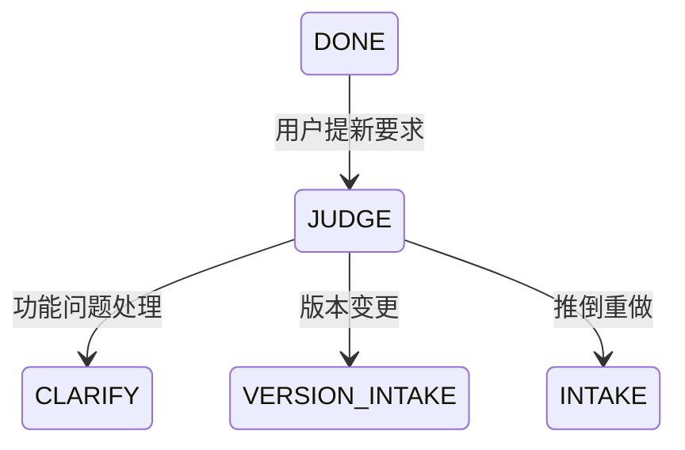

# 版本变更 / 重构 / 更新判定

> 本文件回答两个问题：
> 1. 用户这次提的要求，**算不算版本变更**？
> 2. 如果算，**怎么做**？

---

## 一、判定规则（L5 铁律的落地）

### 核心规则

> **初版本开发完成后，用户继续提要求，一般不认为是在更新，只认为是功能相关问题的处理（视情况而定）。**
> **只有用户明确表示「更新 / 重构 / 变更版本号」时，才启动下一个版本的完整开发流程。**

### 判定信号表

| 用户表述 | 判定 | 走哪条流程 |
|---|---|---|
| 「这里有个 bug」 | 功能问题处理 | 工作流一/二的 TRIAGE 闭环 |
| 「改成……」（局部） | 功能问题处理 | TRIAGE 闭环（可能只需一轮） |
| 「再加一个功能」 | 功能问题处理 | CLARIFY(5–10 题) → RESEARCH → BUILD → TEST |
| 「间距调一下」 | 功能问题处理 | 直接进 BUILD（可跳过调研），仍需过 TEST |
| 「大改一下」 | **模糊 → 必须问** | 停留，用 3 题判定 |
| 「升级到 v2」 | **版本变更** | 本文件第二节 |
| 「重构一下」 | **版本变更** | 本文件第二节 |
| 「推倒重做」 | **版本变更（可能回到 INTAKE）** | 本文件第二节 + 重新采集需求 |
| 「加个登录」（初版没有用户系统） | **疑似版本变更** | 必须问：这算新版本还是本版功能？ |

### 模糊时的 3 题判定（晨专用）

```
1. 这次做完，你希望它是「同一个版本的更好状态」，还是「一个新版本」？
   A. 同一个版本  B. 新版本  C. 我不确定，你判断
2. 这次改动会不会动到已有的数据/接口/用户习惯？
   A. 不会  B. 会一点  C. 会大改
3. 如果改动导致某个旧功能行为变了，你能接受吗？
   A. 能  B. 不能  C. 需要你先告诉我哪个会变
```

判定：
- 三题全 A → 功能问题处理；
- 有 B 或 C → 版本变更；
- 第 3 题选 B → 无论如何都必须走版本变更流程（因为存在兼容性风险）。

**判定结果必须写入** `.cds/state.json` 的 `version_decision`，格式：

```json
{
  "decision": "feature|version",
  "signals": ["用户原话片段"],
  "asked": true,
  "reason": "<一句话理由>",
  "at": "<时间戳>"
}
```

---

## 二、版本变更流程

与工作流一结构相同，但有四处**关键差异**：

### 差异 1：设计必须是「完整流程」，不是补丁

> **原文要求**：设计组首次设计的是单个版本的完整开发流程，是非常详尽的；以后用户表示要更新或重构或其他等等要变更版本号的时候，**才会设计下一个版本的完整开发流程**。

也就是说：
- **v1 设计稿**：完整、详尽（见 `workflow/01-new-project.md` 阶段 3）；
- **v2 设计稿**：同样是一份**完整**的设计稿，不是「v1 的变更说明」；
- 但 v2 设计稿必须**额外包含** `## 与 v1 的差异` 一节，逐条列出增删改。

### 差异 2：必须先做「兼容性影响分析」

B4 在 v2 设计稿中必须新增：

```md
## 兼容性影响分析
| 变更项 | 影响的对象 | 破坏性 | 迁移方案 | 回滚方案 |
|---|---|---|---|---|
| ... | 数据/接口/用户习惯/依赖 | 是/否 | ... | ... |
```

**破坏性变更**（breaking change）必须由晨单独向用户确认，逐条确认，不得打包确认。

### 差异 3：版本号与变更记录

- 版本号规则（SemVer 风格，可按项目调整）：
  - `MAJOR`：破坏性变更；
  - `MINOR`：向后兼容的新功能；
  - `PATCH`：向后兼容的修复。
- 维护 `CHANGELOG.md`，每版必须写：`新增 / 变更 / 废弃 / 移除 / 修复 / 安全`。
- **v1 的产物全部归档**，不覆盖：`design/v1/`、`research/v1/`。

### 差异 4：数据与状态迁移

若涉及数据：
1. **先备份**（并验证备份可恢复）；
2. 写迁移脚本，含**回滚脚本**；
3. 迁移脚本必须在**接近生产的数据量级**上试跑过；
4. 迁移期间的行为（停机？双写？灰度？）必须由用户确认。

---

## 三、重构流程（版本变更的子类）

重构 = 行为不变的内部改造。判定与执行要点：

### 重构前必做

1. **行为快照**：记录关键入口的输入输出（C3 负责，同接手项目）；
2. **明确不变项**：哪些行为必须**逐字节等价**；
3. **明确允许变化项**：性能、内部结构、日志格式等；
4. **明确不做的事**：重构最容易失控的部分，写进版设计稿。

### 重构纪律

| 规则 | 说明 |
|---|---|
| **不夹带功能** | 一次重构里不许加新功能。要加就分两次提交。 |
| **可随时停下** | 每个中间状态都必须可运行、可测试。禁止"半重构"状态进入 TEST。 |
| **小步提交** | 每步可独立验证；单步改动过大时 C3 有权要求拆分。 |
| **回归优先** | 重构轮的 D 组重点是回归测试，D1 必须做全入口基线比对。 |
| **轻量化量化** | 重构轮 B4 的轻量化方案必须给出**前后代码行数对比**，这是重构的主要产出证明。 |

### 重构的收敛标准（比普通修复更严）

- 全部既有入口的**基线输出 100% 一致**（或差异项已逐条获批）；
- S1–S3 bug 为 0；
- 代码行数下降或至少不增（若增，必须说明为什么值得）。

---

## 四、状态机衔接



- `JUDGE` 不是常驻节点，是晨在每次收到新要求时执行的一次判定动作（含 5–10 题追问）。
- `VERSION_INTAKE` 从 `INTAKE` 继承全部流程，并额外加载版本变更差异（本文件第二节）。

---

## 五、快速自检清单（晨每次收到新要求时）

- [ ] 我做了 5–10 题追问吗？（首次对话除外）
- [ ] 我判定「功能处理 / 版本变更 / 推倒重做」了吗？
- [ ] 判定结果写进 `state.json` 了吗？
- [ ] 如果是模糊情形，我问了那 3 题吗？
- [ ] 如果判定为版本变更，我归档 v(n-1) 的产物了吗？
- [ ] 如果涉及破坏性变更，我逐条向用户确认了吗？
